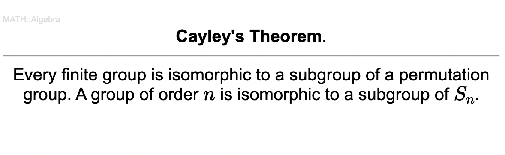
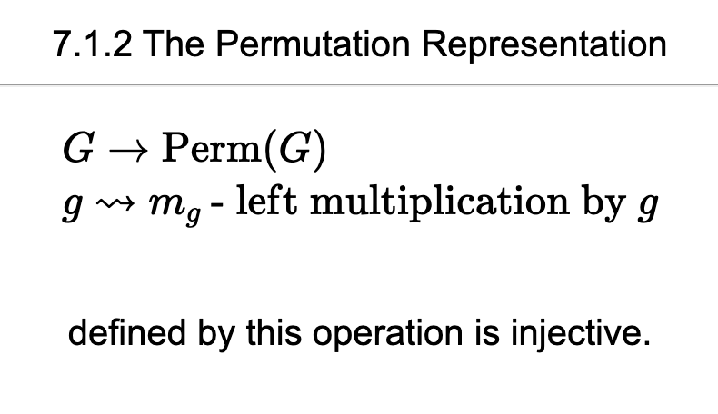

# Markdown2Anki

Convert markdown file to Anki cards.

## Functions

Use AnkiConnect to import Markdown file into anki cards with **Basic** module(have only 2 sides).

### Supported Syntax

Mistune is used to parse markdown file to html.

So syntax like `*..*`, `**..**`,\`..\`(code block), etc are supported.

For more information: https://github.com/lepture/mistune

Extra functions:
1. Support math blocks: $..$ and $$...$$
2. Import media to Anki media folder
3. Keep structures of markdown folder in decks and subdecks in Anki

   (e.g. `./math/algebra.md` will be imported to `math::algebra`)
4. Front of cards will be added the deck name to avoid duplicate
> Note that a known bug is that if you use two syntax to show img in one md file mistune probably will not parse the syntax correctly.
> 
> For example: `\n` will be parsed in wrong syntax.

## How to use

1. Install AnkiConnect plugin in Anki (tutorial: https://foosoft.net/projects/anki-connect/)
2. run `pip install -r requir$ements.txt` to install dependencies
3. run `python main.py path-to-your-md-folder` to start the program with Anki running
> Default separators work as the following example. You can change them in main.py.

### Example

Markdown:
```markdown
7.1.2 The Permutation Representation

%  <--- default separator for front and back (including blank lines before and after)

$$
\begin{aligned}
&G\to\text{Perm}(G)\\
&g\leadsto m_g\text{ - left multiplication by }g
\end{aligned}
$$
defined by this operation is injective.

----  <--- default separator for cards (including blank lines before and after)

7.1.3 **Cayley's Theorem**.

%

Every finite group is isomorphic to a subgroup of a permutation group. A group of order $n$ is isomorphic to a subgroup of $S_n$.
```

Anki:



