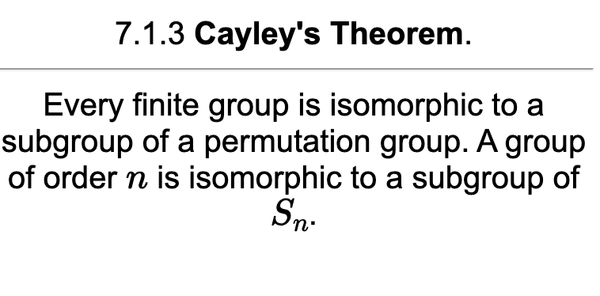
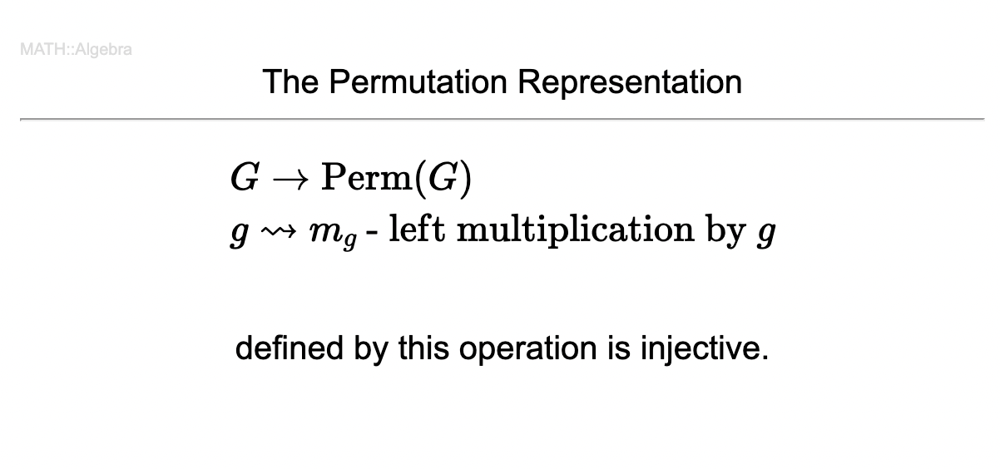

# Markdown2Anki

将Markdown文件转换为anki卡片

Convert md file to anki cards.


## 功能 Functions 

将Markdown文件转换为anki basic 卡片(两面).

支持:
1. 数学公式($..$)
2. 数学块($$..$$)
3. 斜体(*..*)
4. 粗体(**..**)
5. 媒体文件导入Anki媒体文件夹(可在Anki中通过 `` 调用显示)

Convert Markdown file into anki cards with basic template(have only 2 sides).

Support:
1. Math Function($..$)
2. Math Block($$..$$)
3. Italic(*..*)
4. Bold(**..**)
5. Import media to Anki media fold(can be shown in Anki with ``)

## 怎么用 How to use

md2anki.py 默认将同目录下 xx.md 转换为 xx.csv.

默认将该目录下pic文件夹中的媒体文件导入

(可通过修改py中的filePath,csvPath,picPath调整)

默认以`'\n\n%\n\n'`为卡片和标题分隔

xx.csv可直接导入Anki

md2anki.py will automatically convert all xx.md files in the same directory into xx.csv files defaultly.

defaultly import media files in **pics** into Anki media fold

(filePath, csvPatha and picPath can be changed in the py file)

The script takes `'\n\n%\n\n'` as seperator between cards and titles defaultly.

The csv file can be import into Anki directly

### 注意 Notice

导入时需勾选html支持

Select html support while importing


## 例子 Example

Markdown:
```markdown
7.1.2 The Permutation Representation

%

$$
\begin{aligned}
&G\to\text{Perm}(G)\\
&g\leadsto m_g\text{ - left multiplication by }g
\end{aligned}
$$
defined by this operation is injective.

%

7.1.3 **Cayley's Theorem**.

%

Every finite group is isomorphic to a subgroup of a permutation group. A group of order $n$ is isomorphic to a subgroup of $S_n$.
```

Anki:



